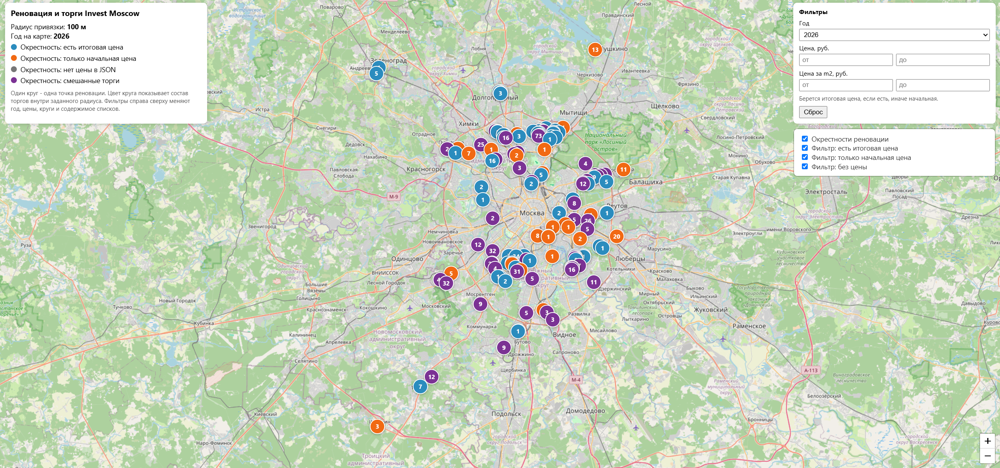

# Parse Invest Moscow



Parse Invest Moscow - это набор скриптов для сбора торгов Invest Moscow и построения HTML карты объектов рядом с точками реновации.

Проект берет координаты объектов реновации, JSON данные торгов Invest Moscow и строит интерактивную карту:

```text
renovation_map.html
```

На карте можно смотреть, какие торги находятся рядом с точками реновации, фильтровать их по году, цене и типу цены.

## Что делает проект

Проект состоит из трех основных шагов:

1. Скачать координаты объектов реновации.
1. Скачать JSON данные торгов Invest Moscow.
1. Построить HTML карту с привязкой торгов к ближайшим точкам реновации.

## Структура проекта

```text
.
|-- .gitignore
|-- LICENSE
|-- README.md
|-- example.png
|-- fetch-renovation-coords.sh
|-- fetch-tender-ids.sh
`-- renovation_geo_analytics.py
```

После запуска скриптов локально также создаются:

```text
data/
renovation_coords.txt
renovation_map.html
```

Эти файлы не хранятся в git.

| Путь | Назначение |
| ----------------------------- | ------------------------------------------------------------------------ |
| `fetch-renovation-coords.sh` | Скачивает координаты объектов реновации и пишет `renovation_coords.txt`. |
| `fetch-tender-ids.sh` | Скачивает JSON данные торгов Invest Moscow в `data/`. |
| `renovation_geo_analytics.py` | Строит HTML карту `renovation_map.html`. |
| `example.png` | Скриншот результата. |
| `data/` | Локальная папка с JSON данными торгов. |
| `renovation_coords.txt` | Локальный файл с координатами реновации. |
| `renovation_map.html` | Готовая локальная HTML карта. |

## Зависимости

Нужны:

```text
sh
curl
jq
python3
pyproj
```

Установка Python зависимости:

```sh
python3 -m pip install pyproj
```

На Arch Linux:

```sh
sudo pacman -S curl jq python python-pip
python3 -m pip install pyproj
```

## Быстрый запуск

Скачать координаты реновации:

```sh
./fetch-renovation-coords.sh
```

Скрипт создаст файл:

```text
renovation_coords.txt
```

Скачать JSON данные торгов:

```sh
./fetch-tender-ids.sh
```

Данные будут сохранены в:

```text
data/*.json
```

Построить карту:

```sh
./renovation_geo_analytics.py
```

По умолчанию используется радиус 100 метров. Год выбирается уже в HTML карте.

Результат:

```text
renovation_map.html
```

Открыть карту:

```sh
xdg-open renovation_map.html
```

## Полная схема

| Шаг | Вход | Выход |
| ----------------------------- | --------------------------------------- | ----------------------- |
| `fetch-renovation-coords.sh` | сайт `fr.mos.ru` | `renovation_coords.txt` |
| `fetch-tender-ids.sh` | сайт `investmoscow.ru` | `data/*.json` |
| `renovation_geo_analytics.py` | `renovation_coords.txt` и `data/*.json` | `renovation_map.html` |

## Как работает карта

Один круг на карте - одна точка реновации.

Радиус круга равен параметру `--radius`.

Например:

```sh
./renovation_geo_analytics.py --radius 100
```

Это значит, что для каждой точки реновации берутся торги в радиусе 100 метров.

Внутри круга показывается число найденных торгов. В popup круга есть сводка и список торгов. Длинный список прокручивается внутри popup.

Цвет круга показывает состав торгов внутри радиуса:

| Цвет | Значение |
| ---------- | --------------------------- |
| синий | Есть итоговая цена. |
| оранжевый | Есть только начальная цена. |
| серый | Нет цены в JSON. |
| фиолетовый | Смешанные торги. |

Статус торгов не используется как жесткий фильтр. Он только показывается в popup.

## Фильтры в HTML карте

В правой верхней части карты есть переключатели:

- `Окрестности реновации`
- `Фильтр: есть итоговая цена`
- `Фильтр: только начальная цена`
- `Фильтр: без цены`

Также есть фильтры:

- `Год`
- `Цена, руб.: от / до`
- `Цена за m2, руб.: от / до`

Если есть итоговая цена, фильтр использует ее. Если итоговой цены нет, используется начальная цена.

В полях цены можно вводить числа без пробелов. Например, `400000` автоматически станет `400 000`.

## Фильтр по году

Обычный запуск строит HTML карту со всеми годами, а год выбирается уже в самой карте:

```sh
./renovation_geo_analytics.py
```

Собрать карту только за один год:

```sh
./renovation_geo_analytics.py --year 2025
```

Собрать карту за несколько лет:

```sh
./renovation_geo_analytics.py --year 2024 --year 2025
```

Собрать карту за диапазон лет:

```sh
./renovation_geo_analytics.py --year-from 2023 --year-to 2025
```

Явно отключить build-time фильтр по году и встроить все годы:

```sh
./renovation_geo_analytics.py --all-years
```

Если задан фильтр по году, объекты без распознанной даты по умолчанию исключаются.

Чтобы оставить объекты без распознанного года:

```sh
./renovation_geo_analytics.py --year 2025 --include-unknown-year
```

Год берется в первую очередь из даты начала приема или подачи заявок. Если такого поля нет, скрипт пытается найти любую дату в JSON.

## Основные параметры

| Параметр | Значение |
| ----------------------------------- | ------------------------------------------------------------------------ |
| `--radius N` | Радиус привязки торгов к точке реновации, в метрах. По умолчанию: `100`. |
| `--year YYYY` | Оставить только торги за указанный год. Можно указать несколько раз. |
| `--year-from YYYY` | Нижняя граница диапазона лет. |
| `--year-to YYYY` | Верхняя граница диапазона лет. |
| `--all-years` | Отключить build-time фильтр по году и встроить все годы. |
| `--include-unknown-year` | При фильтре по году не выкидывать объекты без распознанного года. |
| `--include-empty-renovation-points` | Добавить на карту точки реновации даже без найденных рядом торгов. |
| `--coords FILE` | Файл с координатами реновации. По умолчанию: `renovation_coords.txt`. |
| `--data-dir DIR` | Папка с JSON торгов. По умолчанию: `data`. |
| `--out-dir DIR` | Куда писать `renovation_map.html`. По умолчанию: текущая папка. |

## Примеры

Построить карту с радиусом 100 метров:

```sh
./renovation_geo_analytics.py --radius 100
```

Построить карту с радиусом 250 метров:

```sh
./renovation_geo_analytics.py --radius 250
```

Построить карту только за 2025 год:

```sh
./renovation_geo_analytics.py --year 2025
```

Построить карту за 2024 и 2025 годы:

```sh
./renovation_geo_analytics.py --year 2024 --year 2025
```

Построить карту за диапазон 2023-2025:

```sh
./renovation_geo_analytics.py --year-from 2023 --year-to 2025
```

Построить карту за 2025 год и оставить объекты без распознанного года:

```sh
./renovation_geo_analytics.py --year 2025 --include-unknown-year
```

Построить карту из другой папки с JSON:

```sh
./renovation_geo_analytics.py --data-dir my_data
```

Построить карту и записать результат в отдельную директорию:

```sh
./renovation_geo_analytics.py --out-dir out
```

## Вывод скриптов

`fetch-renovation-coords.sh` пишет данные в:

```text
renovation_coords.txt
```

Можно указать другой выходной файл:

```sh
./fetch-renovation-coords.sh my_coords.txt
```

`fetch-tender-ids.sh` пишет JSON данные в:

```text
data/
```

Служебные сообщения идут в stderr, чтобы stdout оставался чистым для данных и отладки.

`renovation_geo_analytics.py` пишет карту в:

```text
renovation_map.html
```

Также он печатает краткую статистику в терминал:

```text
matched_tenders=...
matched_has_final_price=...
matched_start_price_only=...
matched_no_price=...
renovation_points_with_matches=...
skipped_...
wrote: renovation_map.html
```

## Локальные данные

Эти файлы создаются при запуске скриптов:

```text
data/
renovation_coords.txt
renovation_map.html
```

Они добавлены в `.gitignore` и не должны попадать в репозиторий.

## Ограничения

Скрипты завязаны на текущую структуру ответов сайтов `investmoscow.ru` и `fr.mos.ru`.

Если сайты изменят JSON, HTML или API, парсинг может потребовать обновления.

## Коротко

```sh
./fetch-renovation-coords.sh
./fetch-tender-ids.sh
./renovation_geo_analytics.py
```

После этого откройте:

```text
renovation_map.html
```

## Лицензия

Проект распространяется под лицензией GNU Affero General Public License v3.0. Подробности смотрите в файле LICENSE.
